# Industrial Automation with SIEMENS S7-1200 PLCs

Multi-PLC industrial automation system controlling a conveyor belt, warehouse, and robotic arm. Includes a real-time web monitoring dashboard. The system processed more than 20 parts per demonstration and was presented at official university open-house events and technology fairs.

## Demo

## Context
- **Date:** 2019
- **Institution:** Universidad Politecnica de Yucatan (UPY)
- **Course/Event:** PLCs (Professor Pepe)
- **Type:** University Project

## What It Does
Coordinates three SIEMENS S7-1200 PLCs to run an integrated production line: one PLC drives a conveyor belt, another manages a storage warehouse, and a third controls a robotic arm. An Arduino bridge sends PLC state data to a MySQL database. A web dashboard built with PHP, JavaScript, and AJAX displays the system status in real time, updating every two seconds. The experimental cloud-receive variant attempts bidirectional cloud communication.

## Tech Stack
- SIEMENS TIA Portal V15.1
- 3x SIEMENS S7-1200 PLCs
- PHP, JavaScript, AJAX
- MySQL
- HTML/CSS

## How to Run
Requires SIEMENS TIA Portal V15.1 to open `.ap15_1` project files. The web dashboard requires a PHP/MySQL server (e.g., XAMPP or LAMP stack).

## Files
- `cloud-send/` — Stable version, Arduino sends PLC data to cloud
- `cloud-receive/` — Experimental version, receives commands from cloud
- `web-dashboard/` — PLCMonitorProcess web application (PHP/JS/MySQL)

## Images

### Production Line Overview
| | |
|---|---|
| 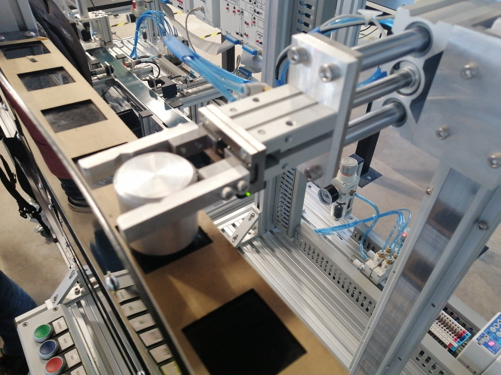 | 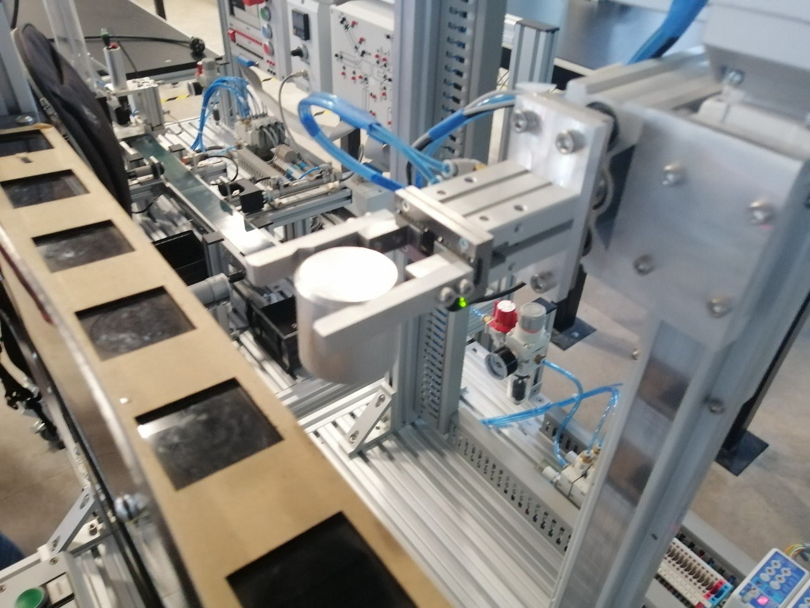 |
| Conveyor belt with robotic arm and filling station | Full view of the filling station with sensors and actuators |

### Conveyor Belt and Sensors
| | |
|---|---|
| 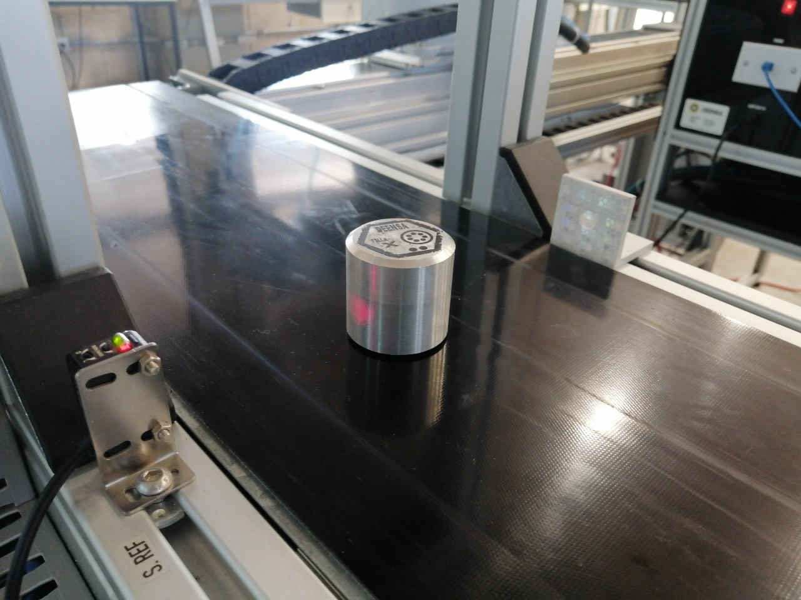 | 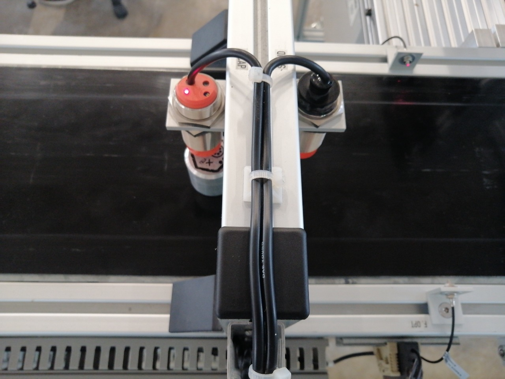 |
| Metal part on conveyor belt passing through sensor array | Top view: inductive and capacitive sensors detecting part |

| | |
|---|---|
| 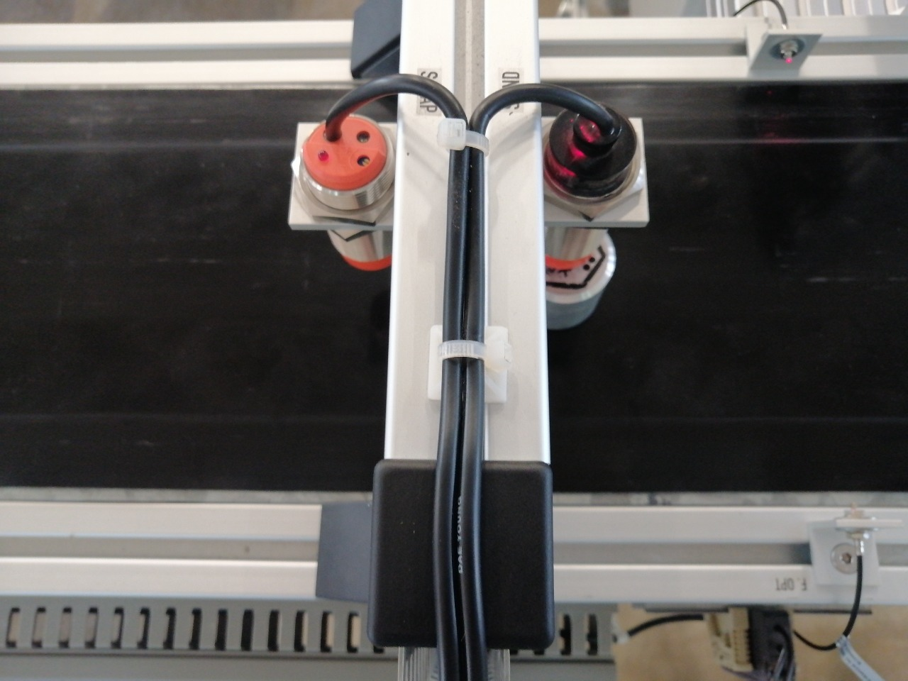 | 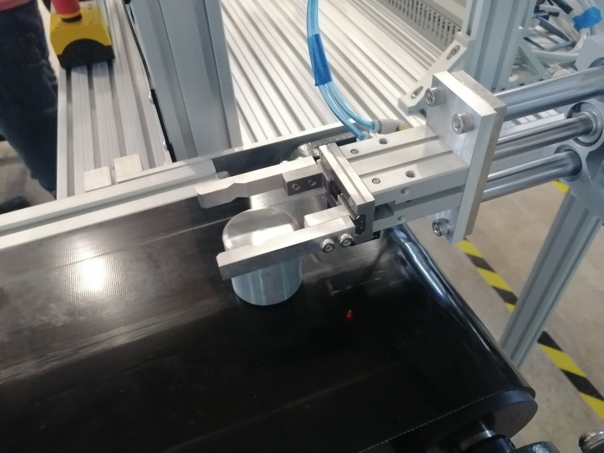 |
| Inductive and capacitive sensors mounted above conveyor | Pneumatic gripper positioning a part on the belt |

### Workstations
| | |
|---|---|
| 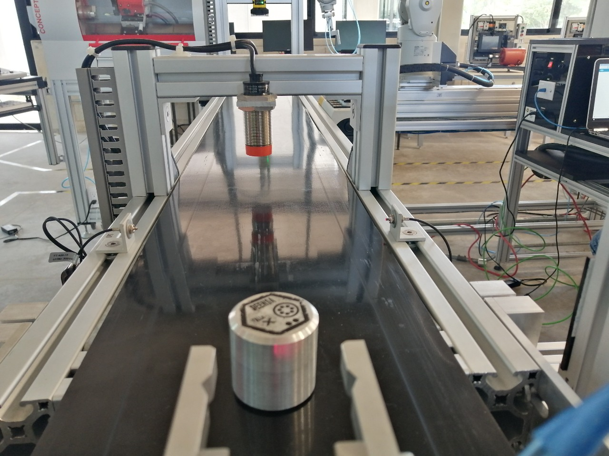 | 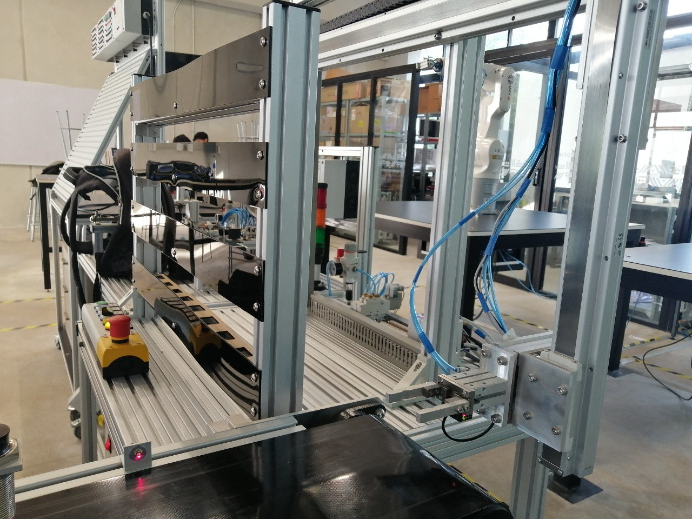 |
| Drill press station processing a part on the conveyor | Full conveyor line with emergency stop button visible |

### Warehouse Storage
| | |
|---|---|
| 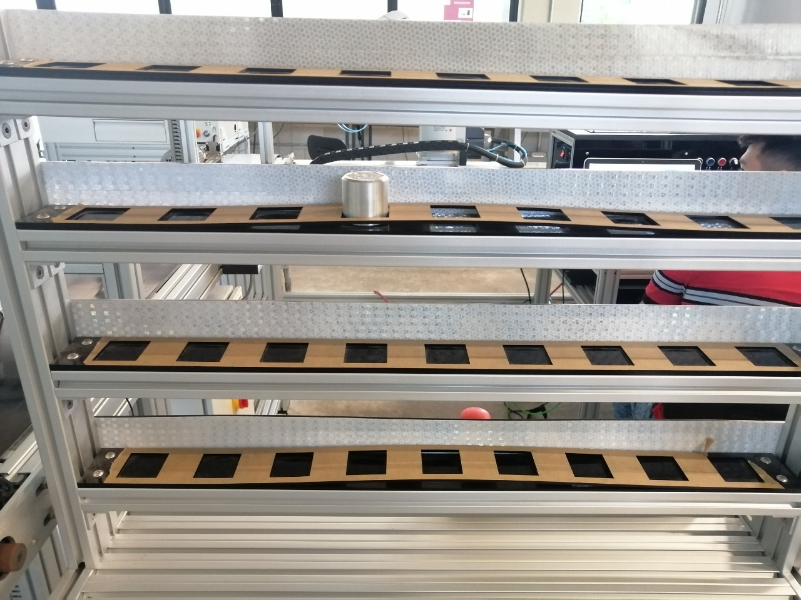 | 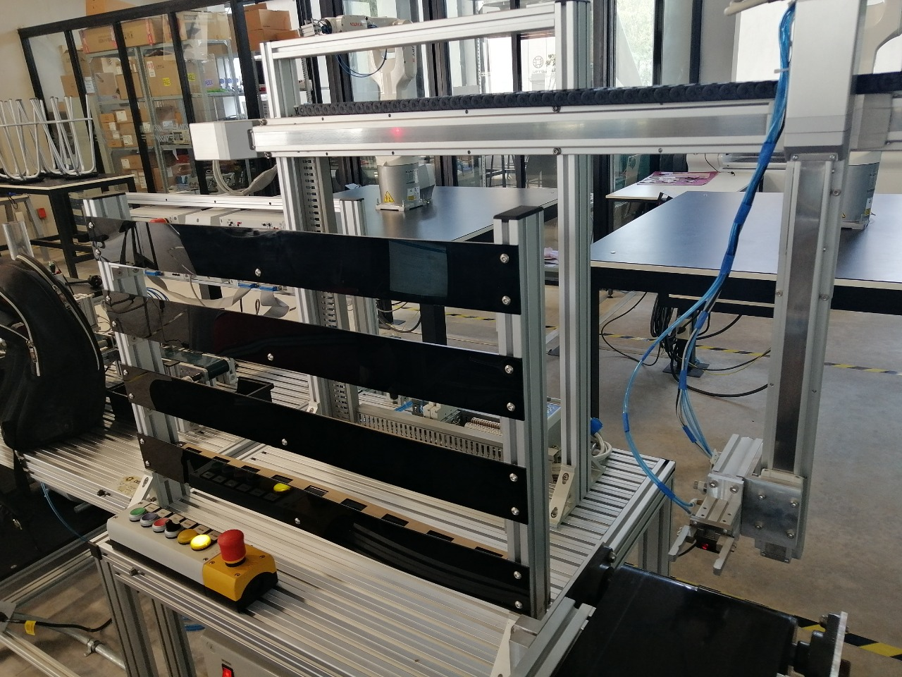 |
| Multi-level warehouse storage shelves | Warehouse module connected to conveyor system |

### Full Production Line
| | |
|---|---|
| 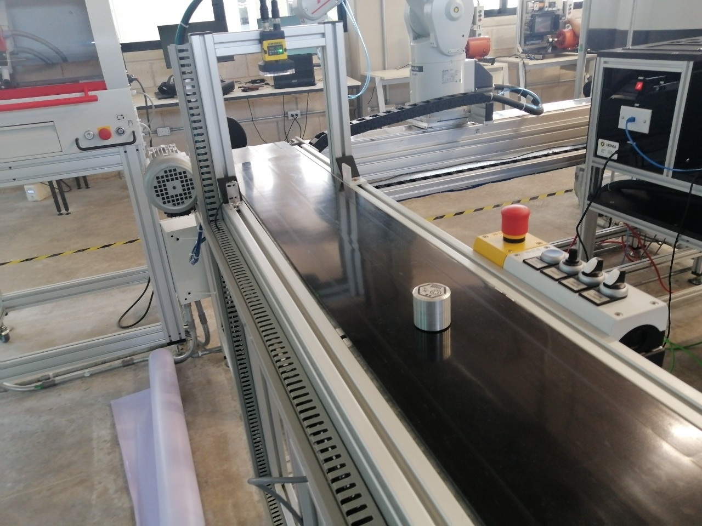 | 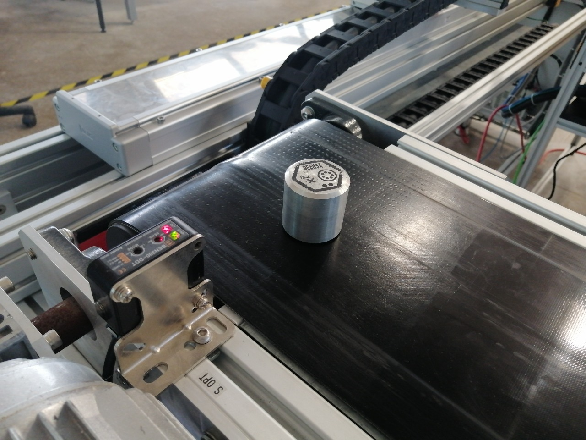 |
| Complete production line with part on conveyor | Alternative angle showing full system integration |

### Controllers
| |
|---|
| 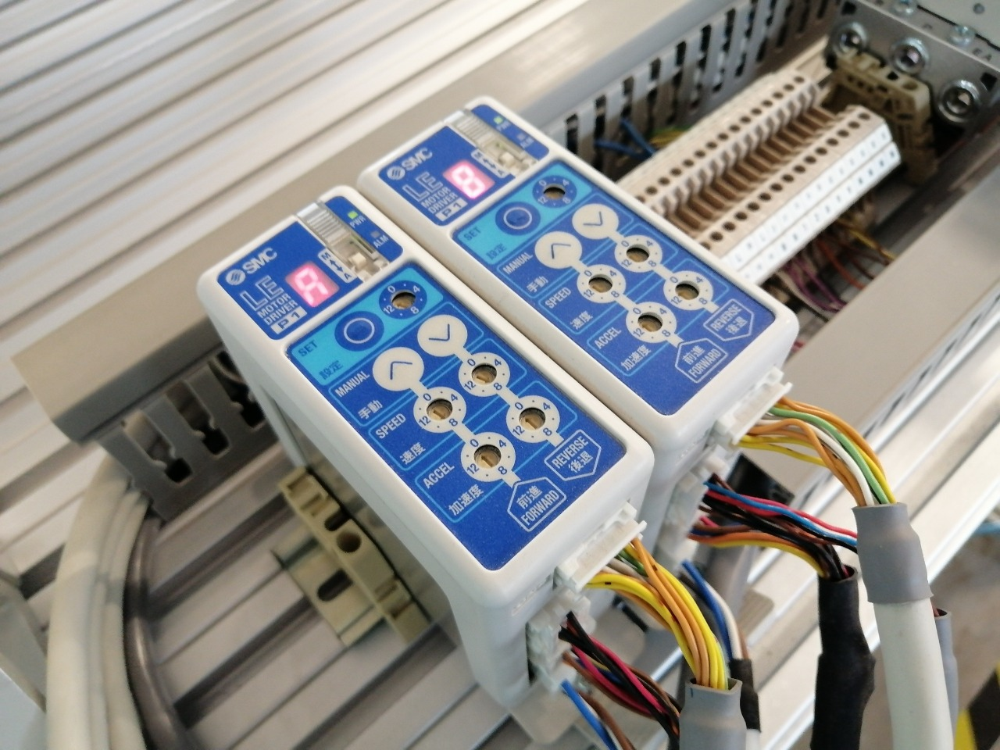 |
| SMC sensor controllers with wiring to PLC I/O modules |
